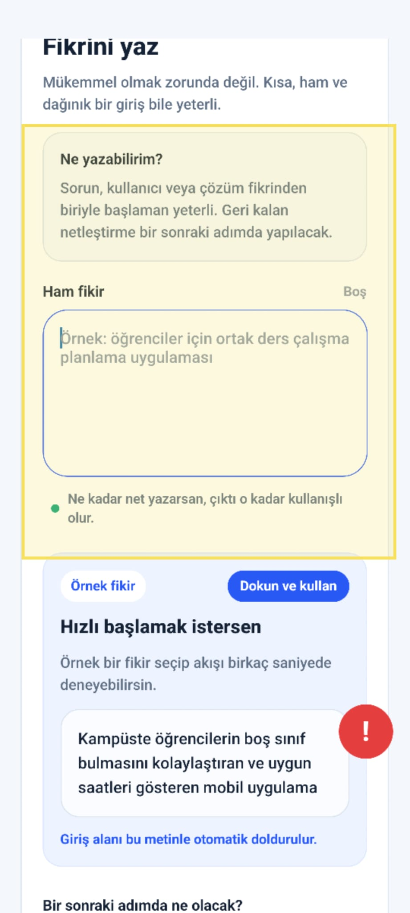

# Audit Report - HomeScreen

**Date:** 17.05.2026 17:45:19  
**Reporter:** 201118062-mergen-wolfscatt  
**Status:** Open  
**Source:** Nokta AuditWidget  
**Screen:** HomeScreen  
**Screenshot File:** ./screenshots/01-home-burada-fikri-hizli-sil.jpeg

## User Note

Burada fikri hızlı sil gibi bir buton olsa iyi olurdu.

## Screenshot

## Forge Input

Use this report as input for one Codex forge cycle:

READ -> LOCATE -> HYPOTHESIZE -> REPAIR -> TEST -> VERIFY -> COMMIT/ROLLBACK

## Expected Agent Scope

- Fix only the issue described in this report.
- Keep the diff minimal.
- Do not touch unrelated screens.
- Do not rewrite the app.

<!-- exportedAt: 2026-05-17T16:02:54.824Z -->
<!-- appName: Nokta Capture -->