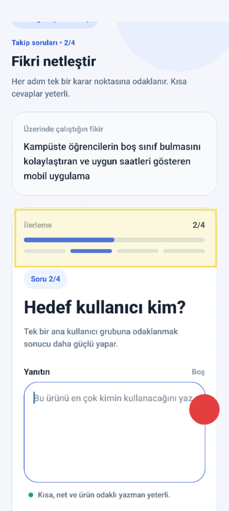

# Audit Report - QuestionsScreen

**Date:** 17.05.2026 17:53:52  
**Reporter:** 201118062-mergen-wolfscatt  
**Status:** Open  
**Source:** Nokta AuditWidget  
**Screen:** QuestionsScreen  
**Screenshot File:** ./screenshots/02-questions-bu-kisimda-ust-uste.jpeg

## User Note

Bu kısımda üst üste 2 tane bar var ve bu güzel gözükmüyor. Tek bir bar yeterli olur

## Screenshot

## Forge Input

Use this report as input for one Codex forge cycle:

READ -> LOCATE -> HYPOTHESIZE -> REPAIR -> TEST -> VERIFY -> COMMIT/ROLLBACK

## Expected Agent Scope

- Fix only the issue described in this report.
- Keep the diff minimal.
- Do not touch unrelated screens.
- Do not rewrite the app.

<!-- exportedAt: 2026-05-17T16:03:52.072Z -->
<!-- appName: Nokta Capture -->