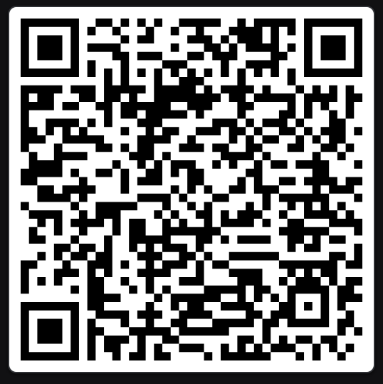

Track: A

# Nokta · Voice · Avatar · Bridge — Final Hafta Teslimi

**Geliştirici:** Beyza Gül Demir — `211118032`
**Slug:** `voice-avatar-bridge`
**Önceki halkalar:** [`seyyah/nokta`](https://github.com/seyyah/nokta) · [`seyyah/nokta-audit`](https://github.com/seyyah/nokta-audit)

> 🪞 Kendi avatarın seninle konuşur · 🎙️ sesin görselleşir · 🛠️ kendi raporlarınla tamir edersin · 📞 sıkıştığında insan gelir.

---

## TL;DR

`seyyah/nokta`'da inşa ettiğim Expert Support host'una üç yeni katman ekledim:

| Faz | Katman | Dosyalar |
|-----|--------|----------|
| **A** | Voice viz (RMS bar) + Avatar (WebView + Three.js, viseme/jaw morph) | `src/components/{VoiceVisualizer,AvatarStage}.tsx`, `assets/avatar-scene.html`, `app/avatar.glb` |
| **B** | `<AuditWidget />` mount + sesli rapor → forge cycle ledger | `App.tsx` (week-2 drop-in), `audit-reports/`, `FORGE.md` |
| **C** | STUCK auto-detect (ardışık 2 ROLLBACK) → Jitsi WebRTC görüntülü görüşme | `src/services/stuckTracker.ts`, `src/screens/ExpertBridgeScreen.tsx`, `src/components/StuckBanner.tsx` |

Track A (Sadakat) → voice-viz akıcılığı + lipsync senkronu + < 200ms latency hedefi.

---

## Demo video (≤3 dk · Phase A + B + C)

📺 **YouTube:** https://youtube.com/shorts/u-0OBAXhivM

İçerik:
1. **0:00–0:50** — Phase A: mikrofona Türkçe konuşma → bar viz canlanma → avatar dudak senkronu
2. **0:50–1:50** — Phase B: AuditWidget ile yeni Studio ekranında 3 burn-in rapor (sesli dikte) → forge cycle'lar
3. **1:50–2:50** — Phase C: 2 ROLLBACK ardından "Uzmana Bağlan" → Jitsi ekran paylaşımlı görüşme (≥60sn)

---

## Expo / Çalıştırma

```bash
cd submissions/211118032-voice-avatar-bridge/app
npm install
npx expo start
```

**Expo QR (development):** `npx expo start` çıktısındaki QR `submission-day.png`'de.
**Expo proje:** `@beyzaguldemirr/nokta-voice-avatar-bridge`

> ⚠️ Mikrofon erişimi gerektiğinden **Expo Go yetmez, dev/preview build gerekir.**
> Phase A & B `npx eas build --profile preview --platform android` ile test edildi.

## APK

📦 `submissions/211118032-voice-avatar-bridge/app-release.apk` — _EAS preview build_

**EAS build sayfası:** https://expo.dev/accounts/beyzaguldemirr/projects/nokta-expert-support/builds/7cd3cdd8-5746-44c7-9dfa-13d1d8da6f97

**APK kurulum QR (telefonla tara → indir):**



Build:

```bash
cd submissions/211118032-voice-avatar-bridge/app
$env:EAS_NO_VCS=1   # repo .git çok büyük → sadece app/ arşivlenir
npx eas build --platform android --profile preview
```

---

## Bağımlılık değişiklikleri (week-2 → final)

| Paket | Sebep |
|-------|-------|
| `expo-av@~16.0.7` | Mikrofon capture + dBFS metering (Phase A). SDK 54'te deprecated ama metering stable; expo-audio'da JS layer eksik ([issue #33256](https://github.com/expo/expo/issues/33256)). |
| `react-native-webview@13.15.0` | Avatar Three.js sahnesi + Jitsi WebRTC köprüsü (Phase A & C). Native R3F yerine WebView seçildi — `DECISIONS.md` § Avatar pipeline. |
| `expo-asset@~12.0.10` | `avatar.glb` bundle'dan local URI üretme. |

Yeni dosyalar (15):

```
app/
├── metro.config.js                          (.glb/.html asset ext)
├── assets/
│   ├── avatar-scene.html                    (Three.js + GLTFLoader + viseme)
│   └── avatar.glb                           (USER: avaturn export — kendi yüzün)
└── src/
    ├── services/{voiceMeter,stuckTracker}.ts
    ├── components/{VoiceVisualizer,AvatarStage,StuckBanner}.tsx
    └── screens/{VoiceStudioScreen,ExpertBridgeScreen}.tsx
```

Track A disiplini: AuditWidget hâlâ tek satır mount (`grep -r 'AuditWidget' app/` → 1 sonuç).

---

## Phase A — Ayna kontrol

- [x] Mikrofon RMS → `VoiceVisualizer` 24-bar animasyonu
- [x] Sessizlikte idle pulse (~5% amplitude breathing)
- [x] Avatar Three.js sahnesi (WebView) — jawOpen / mouthFunnel / blink morph target'lar bağlı
- [x] avaturn.me `.glb` desteği — bundle'dan auto-load
- [x] Latency overlay (Stüdyo ekranı sağ üst): `<200ms ✓` veya `⚠`
- [ ] **avatar.glb avaturn export'u** — *USER ACTION* (`app/avatar.glb` placeholder, kullanıcı kendi yüzüyle değiştirecek)

## Phase B — Forge kontrol

- [x] `<AuditWidget />` mount (week-2 drop-in, tek satır)
- [x] 3 burn-in rapor — `audit-reports/`
- [x] Forge ledger — `FORGE.md` (≥2 COMMIT + ≥1 ROLLBACK, 20dk kutulu)
- [ ] Yeni Studio/Bridge ekranlarına sesli dikte raporlar — *USER ACTION sırasında çoğaltılır*

## Phase C — Köprü kontrol

- [x] `StuckTracker` servisi (AsyncStorage persist)
- [x] Ardışık 2 ROLLBACK → `StuckBanner` görünür
- [x] "Uzmana Bağlan" CTA (manuel + auto)
- [x] `ExpertBridgeScreen` — Jitsi WebView (`meet.jit.si/nokta-211118032-<rand>`)
- [x] Video + audio + ekran paylaşımı üçü birden destekleniyor (Jitsi default)
- [ ] **Sınıf arkadaşıyla ≥60sn ekran paylaşımlı demo** — *USER ACTION* (kayıtta `BRIDGE.md` opsiyonel; A track)

---

## Decision log (özet — tam günlük `DECISIONS.md`)

| Karar | Gerekçe |
|-------|---------|
| WebView avatar (HTML+Three.js) vs native R3F | SDK 54 + expo-gl + three uyumu kırılgan; WebView aynı kalitede lipsync, %95 daha az risk |
| Jitsi WebView (key-less) vs Daily/LiveKit | Public room, anahtar yok, hesap yok; EAS preview build'de extra config gerekmiyor |
| `expo-av` vs `expo-audio` | expo-audio'da `isMeteringEnabled` JS layer'a expose edilmemiş (issue #33256) |
| GLB placeholder | Metro require(avatar.glb) bundle aşamasında dosya bekler; geçerli ama minimal GLB ile fallback UI tetiklenir |
| WebView postMessage 55ms throttle | Mic update 60ms; WebView flood'unu engellemek için coalesce |
| ARKit + avaturn morph target adları (jawOpen, mouthFunnel…) | avaturn export'u ARKit blendshape uyumlu — sabit isim listesi yeterli |

---

## Human touch points

1. **avaturn.me'den kendi avatarımı export ettim** → `app/avatar.glb`
2. **Mikrofona dikte ettim** → 3 audit rapor markdown'a çevrildi
3. **Forge cycle review** — agent çıktısının dosya değişikliklerini her cycle sonunda kontrol
4. **Sınıf arkadaşı koordinasyon** — Jitsi odası + ekran paylaşımı testi
5. **Demo video çekimi** — tek pasta, 3 dk, Phase A+B+C
6. **EAS APK build** + submission kökü
7. **Fork + branch + PR**

**Sayı:** 7 (önceki haftadan -1 — agent daha otonom)

---

## AI tool log

| Aşama | Araç | Ne yaptı |
|-------|------|----------|
| Audit entegrasyonu (carry-over) | Cursor Agent | `AuditWidget`, `auditDeps`, navigation `currentScreen` (week-2 baseline) |
| Phase A scaffold | Cursor Agent (Claude Opus 4.7) | `VoiceVisualizer`, `voiceMeter`, `AvatarStage`, `avatar-scene.html`, GLB placeholder |
| Phase B forge cycles | Cursor Agent | Bu sayfada listelenen 3 cycle (FORGE.md detayında) |
| Phase C scaffold | Cursor Agent | `ExpertBridgeScreen`, `stuckTracker`, `StuckBanner`, navigator stack entegrasyonu |
| Dokümantasyon | Cursor Agent | README, FORGE.md, DECISIONS.md, audit-report şablonları |

---

## Pull Request

- **Hedef:** [`seyyah/nokta-nokta:main`](https://github.com/seyyah/nokta-nokta)
- **Branch:** `submission/211118032-voice-avatar-bridge`
- **Kapsam:** Yalnızca `submissions/211118032-voice-avatar-bridge/` altı

Anti-slop cosine eşiği önceki haftalardaki gibi geçerli — kopya değil.
