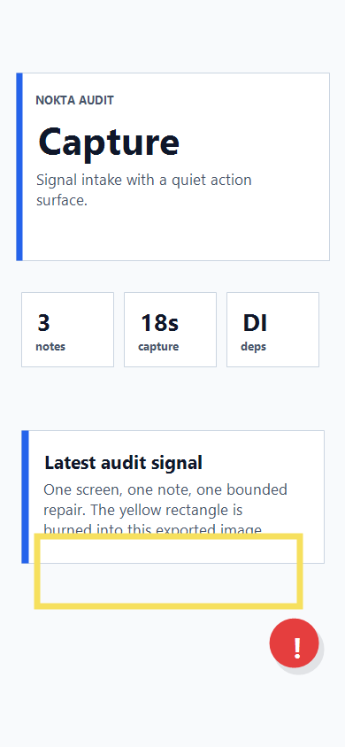

# Audit Report: Capture CTA



## Ekran Adi

Capture (`/`)

## Musteri Notu

CTA satiri altta sikisik duruyor; kullanici rapor almak isterken ana is sinyali ile audit FAB'i ayni bolgeye yigilmis gibi hissediyor.

## Selection Bounds

```json
{ "x": 38, "y": 602, "width": 304, "height": 86 }
```

## Agent Input

READ: Capture ekranindaki alt aksiyon bolgesini incele.

LOCATE: `app/src/NoktaScreen.tsx` ve `app/src/screens.ts`.

HYPOTHESIZE: Alt bant ile FAB baslangic konumu arasinda daha net bosluk gerekir.

REPAIR: Minimal stil ayari yap; audit mount veya deps sozlesmesine dokunma.

VERIFY: Capture ekraninda alt metin okunur kalmali ve audit FAB route bilgisini Capture olarak almali.

## Halka Extension

READ: Capture ekranindaki Ayna panelinde mikrofon seviyesinin hareketini ve avatar agiz tepkisini kontrol et.

LOCATE: `app/src/audioAmplitude.ts`, `app/src/components/VoiceAvatarPanel.tsx`, `app/src/components/AvatarStage.tsx`.

HYPOTHESIZE: `expo-av` metering degeri 80ms aralikla okunursa barlar ve avatar agzi ayni konusma penceresine oturur.

REPAIR: Amplitude gecmisini barlara bagla; Avaturn GLB uzerinde mouth/jaw morph hedefleri bulunursa ayni amplitude ile sur.

VERIFY: Konusurken barlar yukselmeli, sessizlikte idle duruma inmeli, `npm run typecheck` gecmeli.
