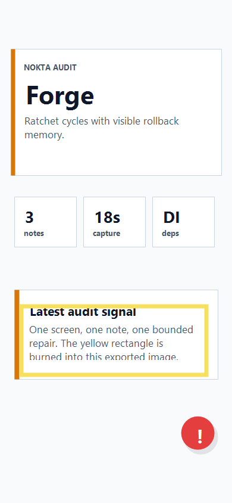

# Audit Report: Forge Ratchet



## Ekran Adi

Forge (`/forge`)

## Musteri Notu

Forge ekraninda basarisiz hipotezlerin de gorunmesi gerekiyor; sadece success yazan bir ledger guven vermiyor.

## Selection Bounds

```json
{ "x": 32, "y": 510, "width": 318, "height": 122 }
```

## Agent Input

READ: Forge ekranini ve `FORGE.md` ledger kolonlarini kontrol et.

LOCATE: `FORGE.md`, `EVAL.md`, `app/src/screens.ts`.

HYPOTHESIZE: Ledger exact kolonlari tasirsa auto-score ve manuel juri ayni izi okuyabilir.

REPAIR: En az 3 success ve 1 rollback cycle yaz; rollback satirini silme.

VERIFY: `FORGE.md` kolonlari `cycle`, `report`, `hypothesis`, `result`, `changed files`, `test result`, `commit hash`, `kg`, `human touch points` olmalidir.

## Halka Extension

READ: Forge ekraninda uzman koprusunun stuck cycle icin kullanilabilir oldugunu kontrol et.

LOCATE: `app/src/components/BridgePanel.tsx`, `BRIDGE.md`, `FORGE.md`.

HYPOTHESIZE: Jitsi odasi tek butonla acilirsa video, audio ve screen share yetenekleri native SDK karmasasi yaratmadan calisir.

REPAIR: `Uzmana Baglan` butonunu Jitsi odasina bagla; web build icin iframe, native icin platform browser/Jitsi app akisi kullan.

VERIFY: Web export derlenmeli; bridge dokumani demo icin gerekli insan kaydini acikca soylemeli.
