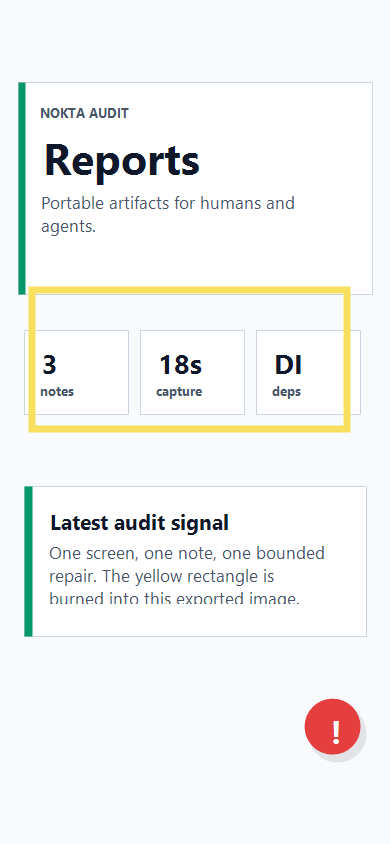

# Audit Report: Reports Export



## Ekran Adi

Reports (`/reports`)

## Musteri Notu

Raporlar bolumunde export amaci guzel ama dosya sahipligi ve artifact sayisi ilk bakista daha belirgin olmali.

## Selection Bounds

```json
{ "x": 28, "y": 286, "width": 322, "height": 146 }
```

## Agent Input

READ: Reports ekranindaki artifact metriklerini ve rapor dosyalarini kontrol et.

LOCATE: `app/src/screens.ts`, `audit-reports/*.md`.

HYPOTHESIZE: Reports ekrani agent-readable artifact fikrini gostermeli, her rapor da kendi burn-in gorseline baglanmali.

REPAIR: UI metinlerini ve rapor markdownlarini minimal tut; backend veya gercek kullanici verisi ekleme.

VERIFY: `audit-reports/` altinda uc `.md` dosyasi ve `assets/` altinda uc burn-in PNG bulunmali.
