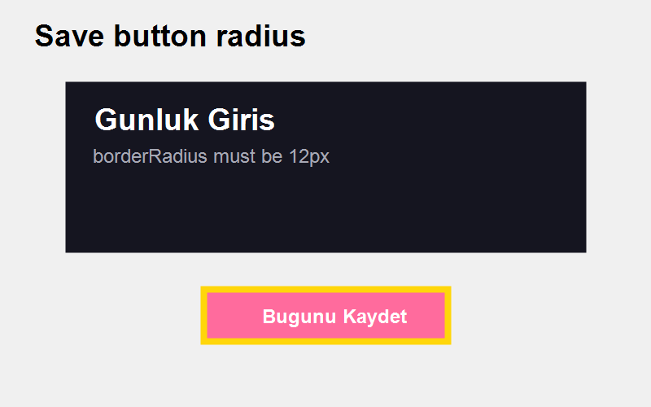

### Bug Report
- **Timestamp:** 2026-05-20 20:55
- **Screen:** HistoryScreen
- **Description:** "HistoryScreen üzerindeki burn-in incelemesinde Save butonunun köşe yarıçapı (borderRadius) çok keskin görünüyor; ortak buton stili 12px olarak yuvarlatılmalı."
- **Screenshot:** ./audit_02.png

### Burn-in
- Yellow box highlights the target interaction area used to validate the shared Save button radius.
