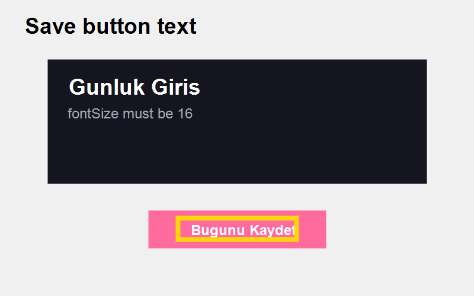

### Bug Report
- **Timestamp:** 2026-05-20 20:58
- **Screen:** ProfileScreen
- **Description:** "ProfileScreen üzerindeki burn-in incelemesinde Save butonu metni çok küçük görünüyor; ortak buton metni fontSize değerini 16 olarak güncelle."
- **Screenshot:** ./audit_03.png

### Burn-in
- Yellow box highlights the text target used to validate the shared Save button font size.
