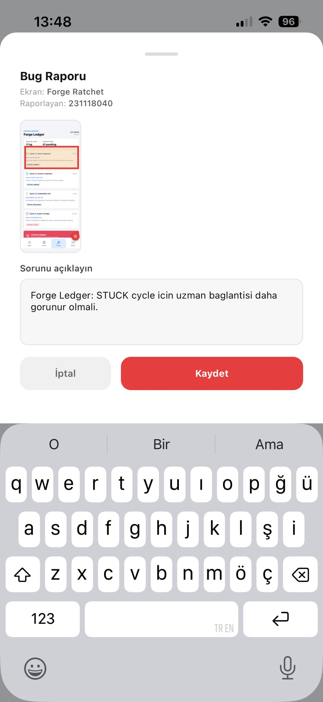

# Audit Report - Forge STUCK Visibility

- Screen: `Forge Ratchet`
- Reporter: `231118040`
- Captured on device: `2026-05-26 13:48` (Europe/Istanbul)
- Source: `AuditWidget` on iPhone Expo Go
- Status at capture: `OPEN`

## Observation

STUCK cycle icin uzman baglantisi daha gorunur olmali.

## Burn-in Evidence

The captured audit form visibly includes the burn-in selection over the forge
cycle state and the typed observation.

