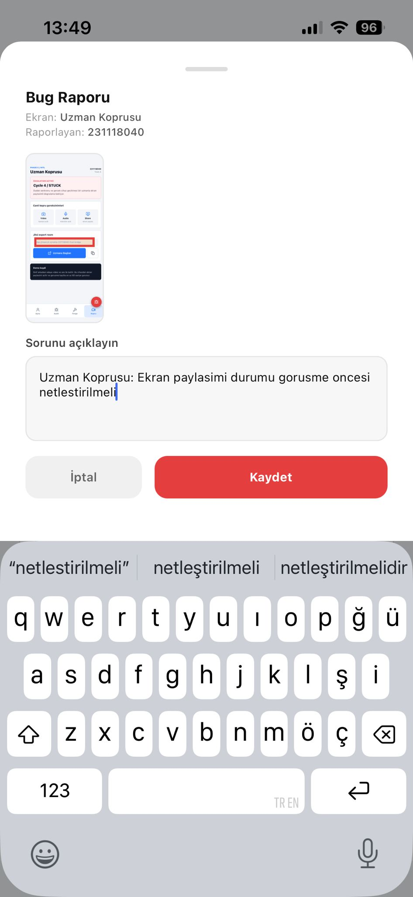

# Audit Report - Bridge Sharing Status

- Screen: `Uzman Koprusu`
- Reporter: `231118040`
- Captured on device: `2026-05-26 13:49` (Europe/Istanbul)
- Source: `AuditWidget` on iPhone Expo Go
- Status at capture: `OPEN`
- Resolution: `ROLLBACK` in Cycle 2, then `SUCCESS` in Cycle 3 (`897b5c8`)

## Observation

Ekran paylasimi durumu gorusme oncesi netlestirilmeli.

## Burn-in Evidence

The captured audit form visibly includes the burn-in selection over the expert
room area and the typed observation.

## Resolution

Ilk hipotez, oturum acilmadan ekran paylasimini hazir gosterdigi icin geri alindi.
Sonraki cycle, video ve mikrofonun izin adimi oldugunu; ekran paylasiminin ise
Jitsi odasi icinde baslatilacagini acikca gosterir.
