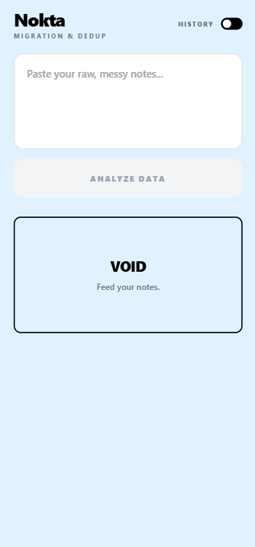

# Audit Report — IdeaCard / Action Row Mobilde Taşıyor

**ID:** `audit-002`
**Screen:** `IdeaCardList` (App.js, `ideas.length > 0`, view mode — kart açık değil)
**Captured:** 2026-05-20 14:27 (Android — Pixel 6, EAS dev build, dark mode ON)
**Reporter:** customer-developer (231118057)
**Severity:** high
**Type:** layout / touch-target

---

## Burn-in Screenshot

> **Not:** Bu image şu an HomeEmpty placeholder ekranını gösteriyor (gerçek IdeaCardList yakalanması TBD — gerçek "burn-in" cycle koşulduktan sonra eklenecek). Aşağıdaki crop region ve bulgu metni IdeaCardList için hazır.
>
> Sarı kutu (burn-in): Kartın altındaki action row — 7 buton (`Approve`, `Reject`, `Note`, `Edit`, `Copy`, `↑`, `↓`) iki satıra düşmüş, ikinci satırdaki `↑ ↓` sol kenara yapışmış, hizalama bozulmuş.
> Crop region (px, 1080×2400 device): `x=48, y=1280, w=984, h=180`

---

## What the customer sees

Kart genişliği ≤ 380dp olduğunda 7 buton sığmıyor → `flexWrap: 'wrap'` devreye giriyor ama bu çirkin:

- İkinci satırda sadece `↑` ve `↓` kalıyor → görsel boşluk, "buraya başka şey gelecek" hissi.
- Touch target'lar `paddingVertical: 8` — yaklaşık 32-34px yükseklik → Apple HIG (44pt) ve Material (48dp) altında. Parmakla iki tane birden basılıyor.
- Dark mode'da disabled hali (`active=false`) `theme.border` (`#2d2d2d`) ile zorlukla seçiliyor — kontrast ratio ~3:1 (WCAG AA fail).

Karar süresini uzatıyor; uzman 50 karta bakacaksa bu satır başına ~2 saniye kayıp = 100 saniye/oturum.

---

## What the customer wants

Action row'u **iki katmanlı** yap:

- **Primary actions (her zaman görünür):** `Approve`, `Reject` — kartın asıl iş akışı.
- **Secondary actions:** `Note`, `Edit`, `Copy`, `↑`, `↓` → bir overflow menüsü (üç nokta ⋯) altına gizle.

Veya minimal varyant: `↑ ↓` butonlarını kartın sağ kenarına dikey iki ufak ok olarak taşı (Gmail mobil benzeri), aşağıdaki row 5 butona düşer ve tek satıra sığar.

Touch target en az 44×44 olsun (padding 12 vertical).

---

## Source context (agent için ipucu)

- `app/src/components/IdeaCard.js:216-242` — action row render bloğu, tüm butonlar `s.actionBtn(...)` ile çiziliyor.
- `app/src/components/IdeaCard.js:50` — `actionBtn` style helper: `paddingVertical: 8` → 12'ye çek touch-target sorunu çözülür.
- `app/src/components/IdeaCard.js:232-241` — `onMoveUp`/`onMoveDown` opsiyonel; bunları ayrı bir `<View>` içine sağ kenara absolute-positioned yerleştirmek tek dosya değişikliği.
- Overflow menü için ekstra dependency gerekmez — `Modal` veya inline conditional yeter; ama Track A için **konum değişikliği** daha minimal.

---

## Suggested forge hypothesis

> `IdeaCard.js:216` action row'unu iki gruba ayır: ana satırda `Approve | Reject | Note | Edit | Copy`, sağ-üst köşeye küçük dikey `↑ ↓` taşı (`position: 'absolute', top: 12, right: 56` — status badge'in soluna). `actionBtn` `paddingVertical` 8→12. Tek dosya, ~25 satır diff.

**Expected diff:** sadece `IdeaCard.js`.
**Risk:** Status badge zaten `position: absolute, top: 12, right: 12` (line 61); `↑ ↓` ile çakışmamak için `right: 56` veya badge sadece status varsa render edildiği için pending durumda `right: 12` kullanılabilir. Test: pending + approved iki kartta da render OK.
