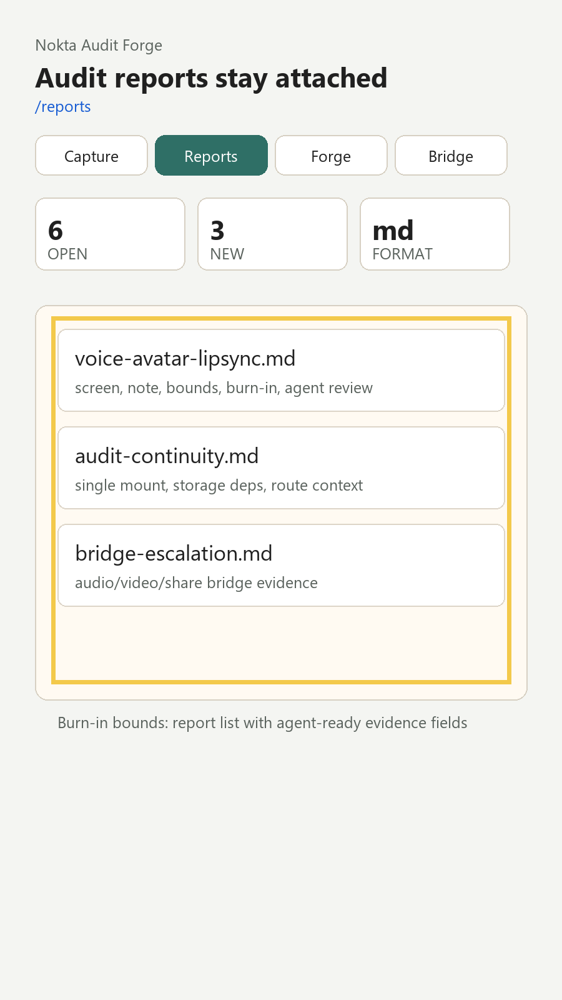

# Audit Report: Audit Continuity



## Screen Name

Reports

## Customer Note

The new audio/avatar work must not break the original Audit-Forge contract. Reports should still expose screen name, note, bounds, evidence and agent interpretation in a form that another agent can use.

## Selection Bounds

```json
{
  "x": 82,
  "y": 506,
  "width": 736,
  "height": 588
}
```

## Evidence

Burn-in evidence highlights the reports list and the three new agent-ready reports.

## Agent Input

READ: Reports are still Markdown artifacts under `audit-reports/`, with visual evidence in `audit-reports/assets/`.

LOCATE: `audit-reports/*.md`, `app/app/_layout.tsx`, `app/src/screens.ts`.

HYPOTHESIS: Adding Capture and Bridge functionality can preserve the single audit mount if route metadata stays declarative and widget deps remain in root layout.

REPAIR: Add route metadata for Bridge, keep `AuditWidget` in `_layout.tsx`, and create new reports without moving storage/capture deps.

TEST: `rg -n "AuditWidget" submissions/231118060-audit-forge/app -g "!node_modules"` and `npm run typecheck`.

RESULT: `AuditWidget` appears once in `_layout.tsx`; typecheck passes after the new route and components.
