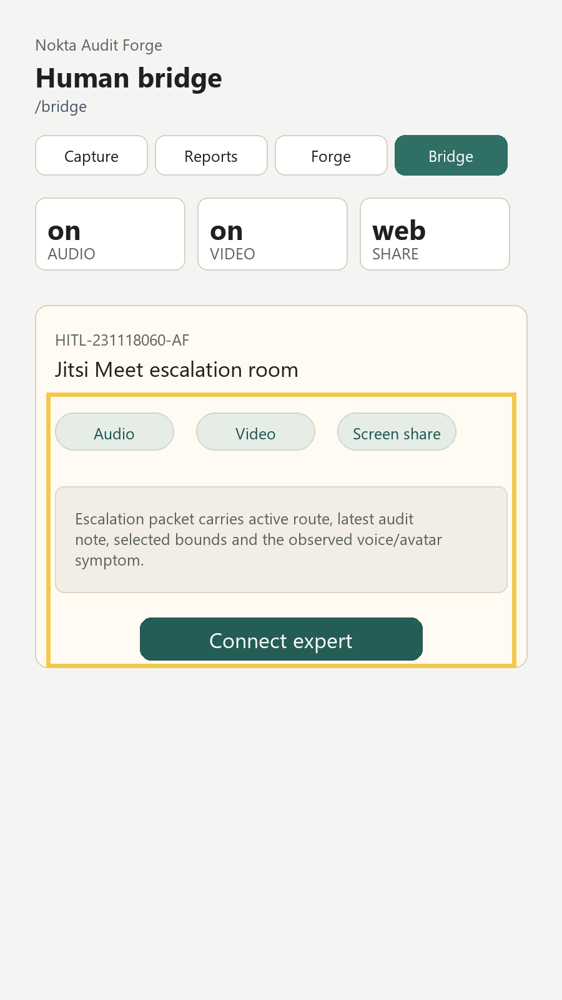

# Audit Report: Bridge Escalation



## Screen Name

Bridge

## Customer Note

When the audit loop gets stuck, I need a real expert handoff. The bridge must support audio, video and screen share without pretending that the app has a custom native call stack.

## Selection Bounds

```json
{
  "x": 74,
  "y": 628,
  "width": 752,
  "height": 440
}
```

## Evidence

Burn-in evidence highlights the Jitsi bridge panel, capability chips and expert connection action.

## Agent Input

READ: The Bridge route is an escalation surface, not a separate toy demo.

LOCATE: `app/src/components/BridgePanel.tsx`, `app/src/bridge/bridgeConfig.ts`, `app/app/bridge.tsx`.

HYPOTHESIS: A Jitsi room opened with `Linking.openURL` is more stable and honest than a fake in-app call screen for this assignment.

REPAIR: Add a Bridge route, present the escalation packet, and launch `https://meet.jit.si/nokta-audit-forge-231118060`.

TEST: `npm run typecheck`; manual test should tap Connect expert and confirm Jitsi opens.

RESULT: TypeScript passes. The bridge depends on external browser/app handling for Jitsi meeting capabilities.
