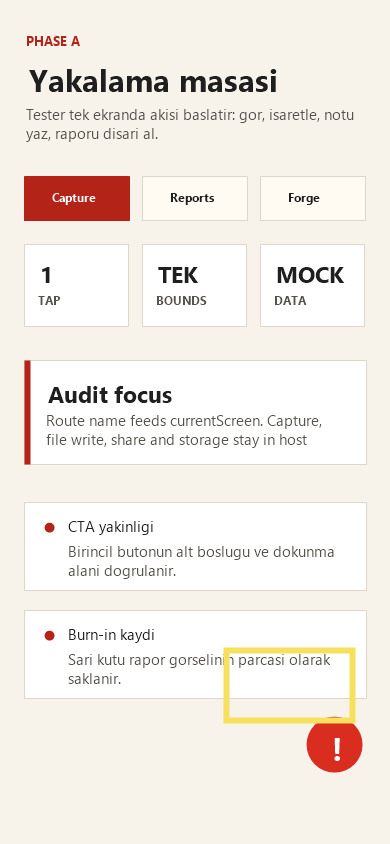

# Audit Report: Capture CTA



## Screen

Capture

## Customer Note

Capture ekranında birincil yakalama CTA'sı FAB alanına fazla yakın hissediliyor. Tester parmağı sağ alta indiğinde rapor FAB'ı ile CTA aynı bölgede yarışıyor; alt boşluk ve dokunma ritmi sadeleştirilmeli.

## Selection Bounds

```json
{
  "x": 226,
  "y": 650,
  "width": 126,
  "height": 70
}
```

## Agent Input

READ: Burn-in görselinde sarı kutu sağ alt CTA/FAB yakınlığını işaretliyor.

LOCATE: `app/src/NoktaScreen.tsx` içindeki `content` padding ve route bazlı aksiyon alanı incelenecek.

HYPOTHESIZE: Alt boşluk 130px olarak sabitlenirse audit FAB ile içerik aynı dokunma bölgesine düşmez.

REPAIR: Scroll content bottom padding değerini koru, CTA kopyasını kısa tut, route tab alanını değiştirme.

TEST: `npm run typecheck` ve `npx expo install --check`.

VERIFY: Capture ekranında alt içerik FAB'ın altında kalmıyor; sarı kutudaki alan artık boşluk tamponu taşıyor.
