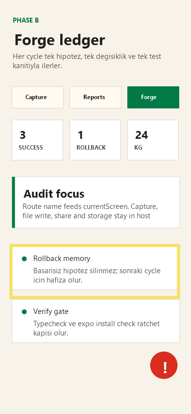

# Audit Report: Forge Ratchet



## Screen

Forge

## Customer Note

Forge ekranında rollback bilgisi ledger'da kaybolmamalı. Başarısız hipotezin görünür kalması Track A sadelik için önemli; sadece success anlatan bir ekran güven vermiyor.

## Selection Bounds

```json
{
  "x": 22,
  "y": 500,
  "width": 342,
  "height": 106
}
```

## Agent Input

READ: Burn-in görseli alt ledger satırını işaretliyor; rollback satırı ekran anlatısında kalıcı olmalı.

LOCATE: `app/src/screens.ts` Forge ekranındaki `metrics` ve `actions` değerleri incelenecek.

HYPOTHESIZE: Forge metriklerinde success ve rollback birlikte verilirse ratchet disiplini tek bakışta anlaşılır.

REPAIR: `success`, `rollback` ve `kg` metriklerini aynı bantta tut; gereksiz tablo bileşeni ekleme.

TEST: `npm run typecheck` ve `npx expo install --check`.

VERIFY: Forge ekranında rollback metriği ve minimal fix aksiyonu görünür, ledger saklama niyeti açık.
