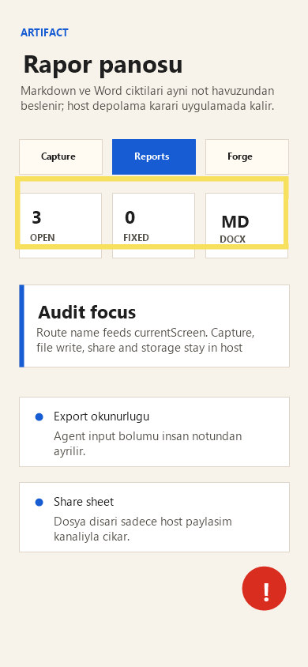

# Audit Report: Reports Export



## Screen

Reports

## Customer Note

Reports ekranında export durumunu okumak için göz metrik kartlarına geri dönüyor. Markdown ve Word çıktılarının agent'a uygun olduğu daha net bir kanıt satırı istiyorum.

## Selection Bounds

```json
{
  "x": 22,
  "y": 226,
  "width": 340,
  "height": 86
}
```

## Agent Input

READ: Sarı kutu rapor metrik bandını işaretliyor; kullanıcı export kanıtını burada arıyor.

LOCATE: `app/src/screens.ts` içinde Reports ekranının `metrics` ve `actions` kopyası incelenecek.

HYPOTHESIZE: Reports ekranında format metriği ve agent input aksiyonu birlikte görünürse export amacı tek bakışta anlaşılır.

REPAIR: Reports kopyasını sade tut, yeni bağımlılık ekleme, widget mount alanına dokunma.

TEST: `npm run typecheck` ve `npx expo install --check`.

VERIFY: Reports ekranında `format md/docx` metriği ve `Agent input` aksiyonu aynı rapor amacını destekliyor.
