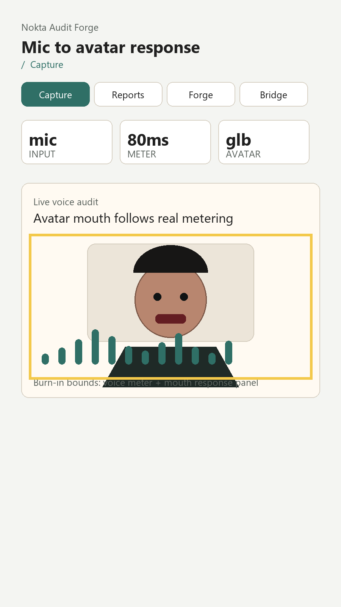

# Audit Report: Voice Avatar Lipsync



## Screen Name

Capture

## Customer Note

The live audit panel should prove that it is listening to the device microphone, not playing a decorative waveform. When I speak, the visual meter and avatar mouth should react together. When I stop, the panel should settle back to idle.

## Selection Bounds

```json
{
  "x": 76,
  "y": 616,
  "width": 748,
  "height": 384
}
```

## Evidence

Burn-in evidence highlights the live voice panel containing the GLB avatar render, mouth target and microphone bars.

## Agent Input

READ: The selected region is the new Capture voice/avatar panel. It must be driven by mic metering, not random animation.

LOCATE: `app/src/audio/useMicrophoneLevel.ts`, `app/src/components/VoiceAvatarPanel.tsx`, `app/src/components/AvatarStage.tsx`.

HYPOTHESIS: Expo AV metering can provide a real amplitude signal at 80ms intervals. A smoothed value can drive both the bars and the `Mouth` node on the GLB avatar.

REPAIR: Keep the recorder hook isolated, map dB to `0..1`, add attack/release smoothing, pass the same amplitude into bars and avatar, and make `isMeteringEnabled: true` explicit in the recording options.

TEST: `npm run typecheck`; manual Android device test should verify permission, silence idle and speech response.

RESULT: TypeScript passes. Runtime mic/device verification remains a manual check because desktop typecheck cannot grant a phone microphone. The resumed hardening pass also adds inline failure states for recorder startup, avatar asset load and bridge URL launch.
