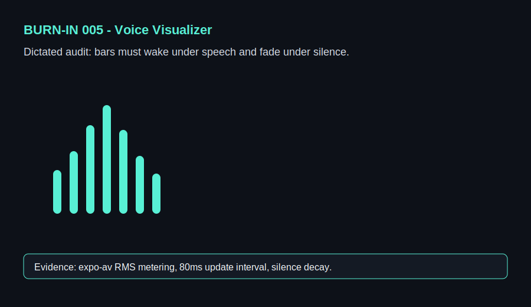

# 005 - Voice Dictated Visualizer Audit

## Voice Dictation

"When I speak, the bars should jump immediately. When I stop, the visualizer should breathe down to silence instead of freezing. This needs to feel like OpenAI voice mode: calm at rest, alive while speaking."

## Forge Input

- Screen: `Voice`
- Problem: no proof that microphone input is driving the interface.
- Expected repair: add `expo-av` microphone metering, RMS-style normalization, and a bar/wave UI.
- Success check: visual response stays under the 200ms target.
