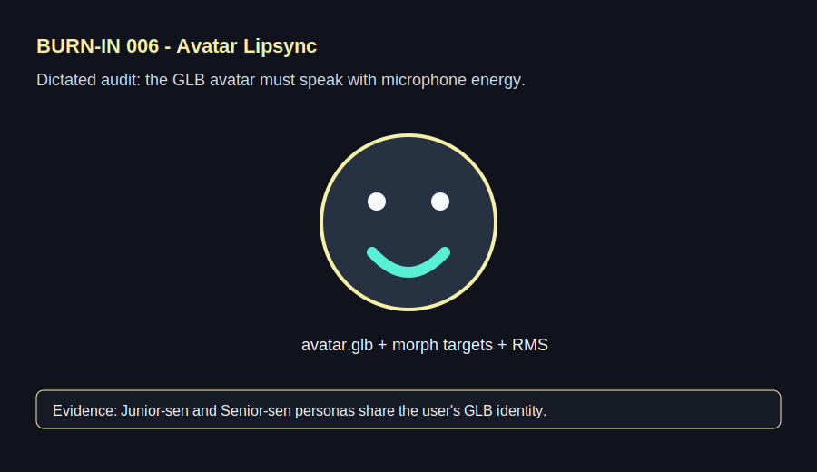

# 006 - Voice Dictated Avatar Audit

## Voice Dictation

"The avatar cannot be a generic head. It has to use my Avaturn GLB and react to my voice. Junior-sen should feel more energetic. Senior-sen should feel slower and more careful."

## Forge Input

- Screen: `Avatar`
- Problem: avatar identity, voice energy, and persona tone were not connected.
- Expected repair: bundle `avatar.glb`, load it in a `react-three-fiber` scene, and drive mouth/viseme morph targets from microphone RMS.
- Success check: switching personas changes delivery while keeping the same face model.
