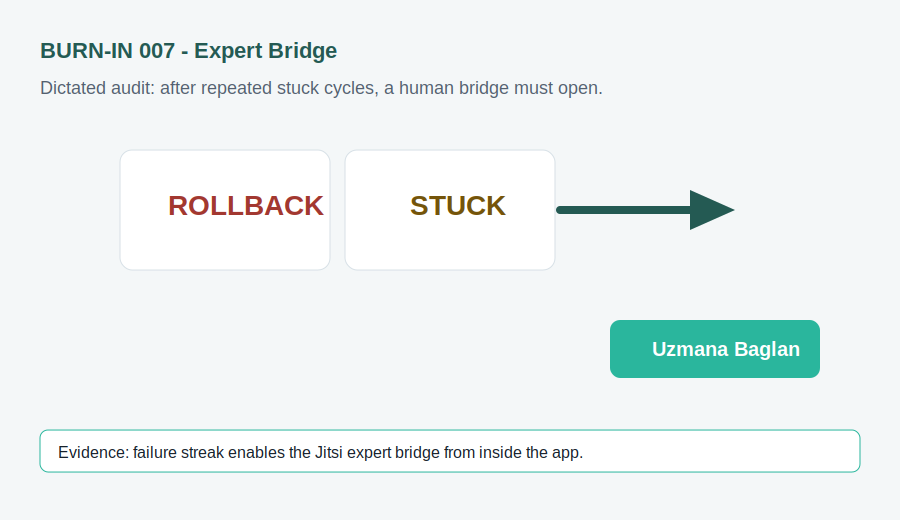

# 007 - Voice Dictated Bridge Audit

## Voice Dictation

"When the agent and I both get stuck, I do not want another text box. I want the app to notice the repeated failure and open a real expert call where screen share, voice, and video can happen."

## Forge Input

- Screen: `Forge`
- Problem: repeated ROLLBACK/STUCK outcomes need a human escalation path.
- Expected repair: add a heuristic that enables `Uzmana Baglan` after two unresolved cycles.
- Success check: the button opens the Jitsi room documented in `BRIDGE.md`.
